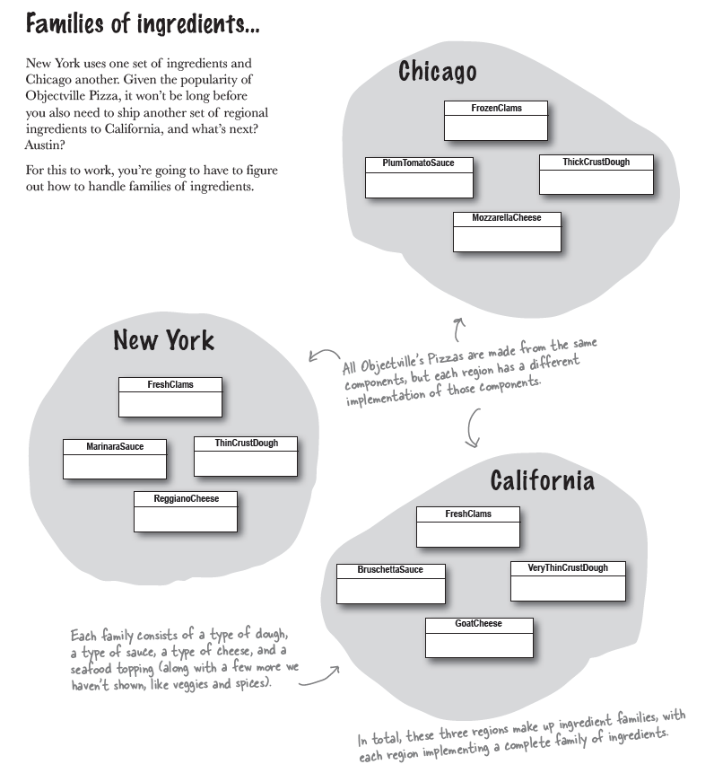
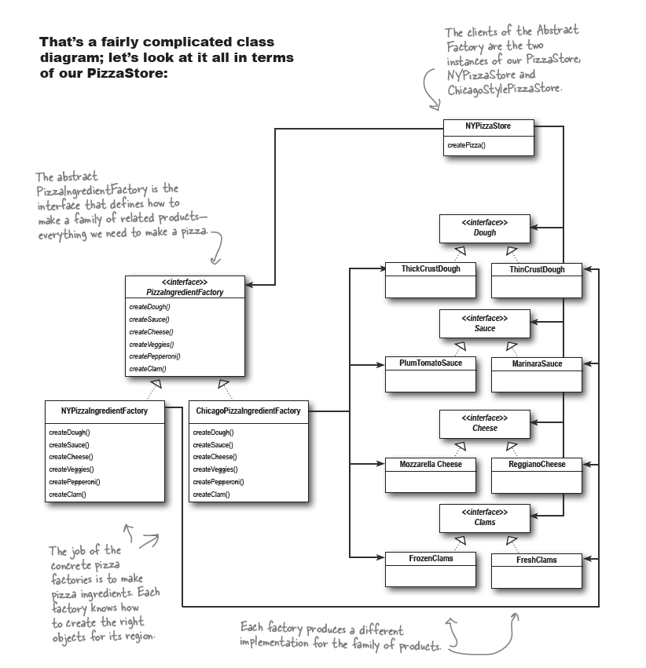

## Chapter 3 : the Decorator Pattern


The Open-Closed Principle

## Design principle 5 : Classes should be open for extension, but closed for modification.

" _While it may seem like a contradiction, there are techniques for allowing code to be
extended without direct modification. Be careful when choosing the areas of code
that need to be extended; applying the Open-Closed Principle EVERYWHERE is
wasteful and unnecessary, and can lead to complex, hard-to-understand code._ "

### Meet the Decorator Pattern

So, here’s what we’ll do. we’ll start with a beverage and “decorate”
it with the condiments at runtime. For example, if the customer wants a
Dark Roast with Mocha and Whip, then we’ll:
1. Start with a DarkRoast object.
2. Decorate it with a Mocha object.
3. Decorate it with a Whip object.
4. Call the cost() method and rely on delegation to add up the condiment costs.


Okay, here’s what we k now about Decorators, so far...
* Decorators have the same supertype as the objects they decorate.
* You can use one or more decorators to wrap an object.
* Given that the decorator has the same supertype as the object it decorates, we can
pass around a decorated object in place of the original (wrapped) object.
* The decorator adds its own behavior before and/or after delegating to the object it
decorates to do the rest of the job. 
* Objects can be decorated at any time, so we can decorate objects dynamically at
runtime with as many decorators as we like.

Definition : _The Decorator Pattern attaches additional responsibilities to an object dynamically.
Decorators provide a flexible alternative to subclassing for extending functionality._


[Check this commit for starbuzz](https://github.com/Apurba000/Design-Patterns/commit/45bf904e1ad3dab1e8b61d50fb4ea4638034136e)

## Chapter 04 : the Factory Pattern


Your Objectville Pizza Store has done so well that you’ve trounced
the competition and now everyone wants a Pizza Store in their
own neighborhood. As the franchiser, you want to ensure the
quality of the franchise operations and so you want them to use
your time-tested code.

But what about regional differences? Each franchise might want to
offer different styles of pizzas (New York, Chicago, and California,
to name a few), depending on where the franchise store is located

Lets see one approach 

```java
NYPizzaFactory nyFactory = new NYPizzaFactory();
PizzaStore nyStore = new PizzaStore(nyFactory);
nyStore.orderPizza("Veggie");

ChicagoPizzaFactory chicagoFactory = new ChicagoPizzaFactory();
PizzaStore chicagoStore = new PizzaStore(chicagoFactory);
chicagoStore.orderPizza("Veggie");
```

you found was that the franchises were using your factory to
create pizzas, but starting to employ their own home-grown
procedures for the rest of the process: they’d bake things
a little differently, they’d forget to cut the pizza, and they’d
use third-party boxes.

Solution : 

what you’d really like to do is create a **framework** that ties the store and the
pizza creation together. 


[Check this commit for full code](https://github.com/Apurba000/Design-Patterns/commit/7fdcd9ec2aa1de48b9ef6fc003558459a6037ec6)


Factory Method Pattern Definition : 

**The Factory Method Pattern** defines an interface
for creating an object, but lets subclasses decide which
class to instantiate. Factory Method lets a class defer
instantiation to subclasses.

### Design principle 6 : (The Dependency Inversion Principle) Depend upon abstractions. Do not depend upon concrete classes

“Program to an interface, not an implementation,” right? It is similar;
however, the Dependency Inversion Principle makes an even 
stronger statement about abstraction. It suggests that our
high-level components should not depend on our low-level
components; rather, they should both depend on abstractions.

how we’d apply this principle to our very dependent PizzaStore implementation

after we’ve applied the Factory Method Pattern, our diagram looks like this:


Factory Method is not the only technique for adhering to the Dependency
Inversion Principle, but it is one of the more powerful ones.

#### Back at the Pizza Store

Now, the key to Objectville Pizza’s success has always been fresh,
quality ingredients, and what you’ve discovered is that with the
new framework your franchises have been following your procedures,But
Some pizza shops have been using cheaper, lower-quality ingredients in 
their pizzas to save money and make more profit.



Now we’re going to build a factory to create our ingredients. the
factory will be responsible for creating each ingredient in the
ingredient family.

```java
public interface PizzaIngredientFactory {
    public Dough createDough();
    public Sauce createSauce();
    public Cheese createCheese();
    public Veggies[] createVeggies();
    public Pepperoni createPepperoni();
    public Clams createClam();
}
```
Here is the implementation of NYPizzaIngredientFactory and ChicagoPizzaIngredientFactory

```java
public class NYPizzaIngredientFactory implements PizzaIngredientFactory{
    @Override
    public Dough createDough() {
        return new Dough("ThinCrustDough");
    }

    @Override
    public Sauce createSauce() {
        return new Sauce("MarinaraSauce");
    }

    @Override
    public Cheese createCheese() {
        return new Cheese("ReggianoCheese");
    }

    @Override
    public Veggies[] createVeggies() {
        Veggies[] veggies = {new Veggies("Garlic"), new Veggies("Onion"), new Veggies("Mushroom"), new Veggies("RedPepper")};
        return veggies;
    }

    @Override
    public Pepperoni createPepperoni() {
        return new Pepperoni("SlicedPepperoni");
    }

    @Override
    public Clams createClam() {
        return new Clams("FreshClams");
    }
}


public class ChicagoPizzaIngredientFactory implements PizzaIngredientFactory{

    @Override
    public Dough createDough() {
        return new Dough("ThickCrustDough");
    }

    @Override
    public Sauce createSauce() {
        return new Sauce("Plum Tomato Sauce");
    }

    @Override
    public Cheese createCheese() {
        return new Cheese("MozzarellaCheese");
    }

    @Override
    public Veggies[] createVeggies() {
        Veggies[] veggies = {new Veggies("Spinach"), new Veggies("BlackOlives"), new Veggies("EggPlant")};
        return veggies;
    }

    @Override
    public Pepperoni createPepperoni() {
        return new Pepperoni("SlicedPepperoni");
    }

    @Override
    public Clams createClam() {
        return new Clams("FrozenClams");
    }
}

```
Need to rework our Pizzas so they only use factory-produced ingredients

```java
public abstract class Pizza {
    protected String name;

    protected Dough dough;
    protected Sauce sauce;
    protected Veggies veggies[];
    protected Cheese cheese;
    protected Pepperoni pepperoni;
    protected Clams clam;
    protected abstract void prepare();
    void bake() {
        System.out.println("Bake for 25 minutes at 350");
    }
    void cut() {
        System.out.println("Cutting the pizza into diagonal slices");
    }
    void box() {
        System.out.println("Place pizza in official PizzaStore box");
    }
    public void setName(String name) {
        this.name = name;
    }
    public String getName() {
        return name;
    }
}
```
Now Lets create CheesePizza class 
```java
public class CheesePizza extends Pizza {
    private PizzaIngredientFactory ingredientFactory;
    public CheesePizza(PizzaIngredientFactory ingredientFactory) {
        this.ingredientFactory = ingredientFactory;
    }
    public void prepare() {
        System.out.println("Preparing " + name);
        dough = ingredientFactory.createDough();
        sauce = ingredientFactory.createSauce();
        cheese = ingredientFactory.createCheese();
    }

}
```
Revisiting our pizza stores
```java
public class NYPizzaStore extends PizzaStore {

    protected Pizza createPizza(String item) {
        Pizza pizza = null;
        PizzaIngredientFactory ingredientFactory = new NYPizzaIngredientFactory();
        switch (item) {
            case "cheese" -> {
                pizza = new CheesePizza(ingredientFactory);
                pizza.setName("New York Style Cheese Pizza");
            }
            case "veggie" -> {
                pizza = new VeggiePizza(ingredientFactory);
                pizza.setName("New York Style Veggie Pizza");
            }
            case "clam" -> {
                pizza = new ClamPizza(ingredientFactory);
                pizza.setName("New York Style Clam Pizza");
            }
            case "pepperoni" -> {
                pizza = new PepperoniPizza(ingredientFactory);
                pizza.setName("New York Style Pepperoni Pizza");
            }
        }
        return pizza;
    }
}
```

Full code will be found in "ch04_factory.abstruct_factory"
package

We provided a means of creating a family of ingredients for pizzas by introducing
a new type of factory called an _Abstract Factory_.

**An Abstract Factory provides an interface for
a family of products. What’s a family? In our
case, it’s all the things we need to make a pizza:
dough, sauce, cheese, meats, and veggies.**

Definition : 

**The Abstract Factory Pattern provides an interface
for creating families of related or dependent objects
without specifying their concrete classes.**




Both Abstract Factory and Factory Method create objects. 
But Factory Method do it through inheritance. 
Abstract Factory do it through object composition.

**Abstract Factory**: Thanks. Remember me, Abstract
Factory, and use me whenever you have families of
products you need to create and you want to make sure
your clients create products that belong together.

**Factory Method**: And I’m Factory Method; use me to
decouple your client code from the concrete classes you
need to instantiate, or if you don’t know ahead of time all
the concrete classes you are going to need. To use me, just
subclass me and implement my factory method!


* All factories encapsulate object creation.
* Simple Factory, while not a bona fide design 
pattern, is a simple way to decouple your clients from concrete classes.
* Factory Method relies on inheritance: object creation is
delegated to subclasses, which implement the factory method to create objects.
* Abstract Factory relies on object composition: object creation is implemented in
methods exposed in the factory interface.
* All factory patterns promote loose coupling by reducing the
dependency of your application on concrete classes.
* The intent of Factory Method is to allow a class to defer 
instantiation to its subclasses.
* The intent of Abstract Factory is to create families of related
objects without having to depend on their concrete classes.
* The Dependency Inversion Principle guides us to avoid dependencies on concrete
types and to strive for abstractions.
* Factories are a powerful technique for coding to abstractions, not concrete
classes.

## Design Principles 

* Design Principle 1 : Identify the aspects of your application that vary and
  them from what stays the same.
* Design Principle 2 : Program to an interface, not an implementation.
* Design Principle 3 : Favor composition over inheritance.
* Design Principle 4 : Strive for loosely coupled designs between objects that interact.
* Design principle 5 : Classes should be open for extension, but closed for modification.
* Design principle 6 : (The Dependency Inversion Principle) Depend upon abstractions. Do not depend upon concrete classes


