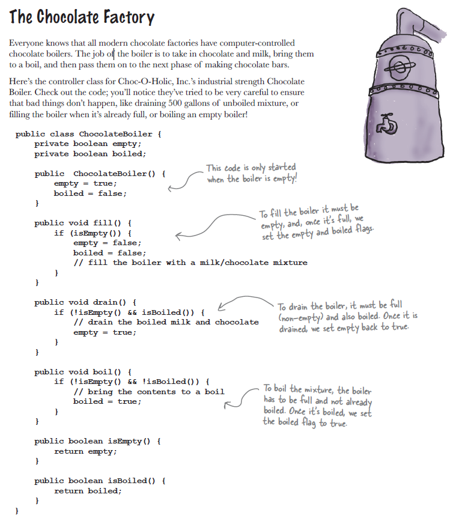
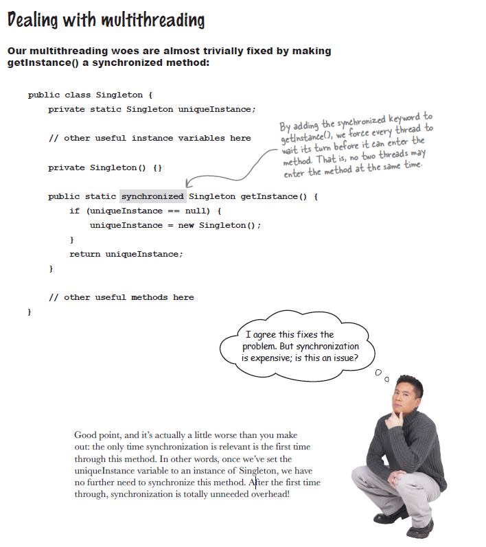
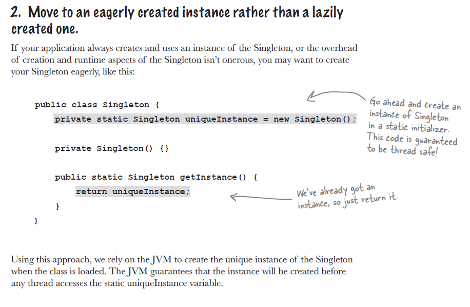
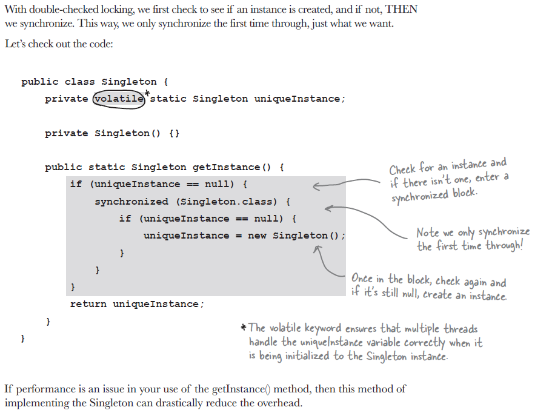
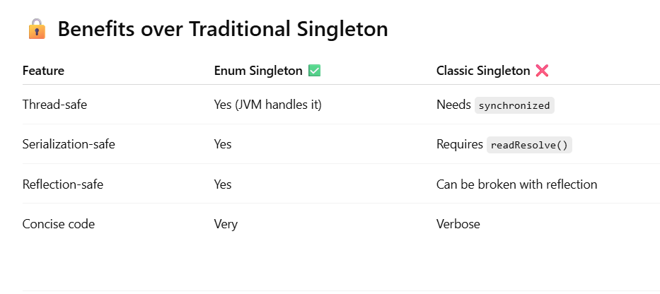

## Chapter 5 : The singleton pattern



### Definition 
The Singleton Pattern ensures a class has only one
instance, and provides a global point of access to it.

Here is the classic implementation of Singleton

```java
public class ChocolateBoiler {

    private static ChocolateBoiler instance;
    private boolean empty;
    private boolean boiled;
    private ChocolateBoiler() {
        empty = true;
        boiled = false;
    }

    public static ChocolateBoiler getInstance(){
        if (instance == null){
            instance = new ChocolateBoiler();
        }
        return instance;
    }

    public void fill() {
        if (isEmpty()) {
            empty = false;
            boiled = false;
            // fill the boiler with a milk/chocolate mixture
        }
    }
    public void drain() {
        if (!isEmpty() && isBoiled()) {
            // drain the boiled milk and chocolate
            empty = true;
        }
    }
    public void boil() {
        if (!isEmpty() && !isBoiled()) {
            // bring the contents to a boil
            boiled = true;
        }
    }
    public boolean isEmpty() {
        return empty;
    }
    public boolean isBoiled() {
        return boiled;
    }
}
```
But we have a problem When we have more than one thread we create more than one object




We obviously need to ensure that the Singleton works in the presence of multiple threads.
But it’s expensive to synchronize the getInstance() method, so what do we do?
We can do few things ....

1. Do nothing if the performance of getInstance() isn’t critical to your application.
2. Move to an eagerly created instance rather than a lazily created one.



3. Use “double-checked locking” to reduce the use of
   synchronization in getInstance().



We can use ENUM for Singleton. 



All the example can be found in 
[Here]("https://github.com/Apurba000/Design-Patterns/tree/master/src/ch05_singleton")


